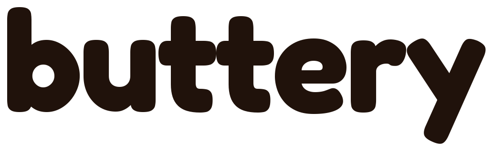
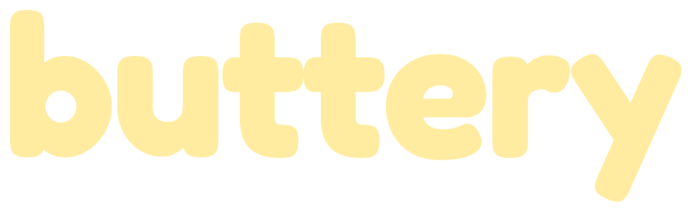

<div class="buttery-hero" markdown>

<h1 class="wordmark"></h1>
<p class="tagline">Buttery smooth, agent-friendly explainer animations in Python.</p>
</div>

```
❯ Use buttery to make an animated explainer of merging two sorted lists.
```

{ .example }

*[`examples/merge_sorted.py`](https://github.com/fletchgraham/buttery/blob/main/examples/merge_sorted.py): the merge is simulated in Python, then each step becomes keyframes.*

## Key features

- **The scene is a pure function of time.** `state(t)` resolves every property at `t`. Nothing accumulates
  between frames, so every frame renders independently and in parallel, and a scrub to any `t` is exact.
- **Pydantic models are the schema.** JSON is the product contract; the Python API is sugar over the same
  models. `buttery schema` prints the JSON schema an agent can build against.
- **Properties are expressions, not values.** Tweens, keyframes, `sin(6 * T)`, and references to other
  objects' properties (`ring.x = dot.ref.x`) form a dependency DAG, so edges follow nodes for free.
  Shorthand strings like `"dot.r + 0.5"` parse into the same tree, no `eval`.
- **Built for agents.** `validate` / `state` / `preview` / `render` as a CLI, a Python API, and an MCP server.
  Every call returns `{"ok": true, ...}` or a structured error list, never a bare stack trace. A Claude Code
  skill is included.
- **Explainer primitives.** `circle rect line text group`, and a `code` block that syntax-highlights Python and
  lets spans select by token, line, or character range.
- **Validation up front.** Structural checks from pydantic (unknown fields, arity, colors) plus semantic checks:
  unique ids, references resolve, no dependency cycles.
- **Real motion blur.** A skia-python renderer samples sub-frames across a configurable shutter, uses every
  core, and writes an `.mp4` through ffmpeg or a PNG sequence without it.

## Thirty seconds of buttery

```bash
pip install buttery
```

```python
from buttery import *

dot = Circle("dot", r=0.3, fill="coral")
dot.x = tween(-3, 3, at=0, dur=1.5, ease="out_cubic")
dot.y = 0.2 * sin(6 * T)

ring = Circle("ring", fill=None, stroke="white")
ring.x = dot.ref.x
ring.r = dot.ref.r + 0.5

scene = Scene(duration=3).add(dot, ring, Text("label", content="Hello", y=-1.6))
scene.render("out.mp4")
```

The same scene as JSON, which is what an agent writes:

```json
{
  "duration": 3,
  "objects": [
    {"id": "dot", "type": "circle", "r": 0.3, "fill": "coral",
     "x": {"op": "tween", "keys": [[0, -3], [1.5, 3]], "ease": "out_cubic"},
     "y": "0.2 * sin(6 * t)"},
    {"id": "ring", "type": "circle", "fill": null, "stroke": "white", "x": "dot.x", "r": "dot.r + 0.5"},
    {"id": "label", "type": "text", "content": "Hello", "y": -1.6}
  ]
}
```

```bash
buttery render scene.json out.mp4
```

## Where to go next

<div class="grid cards" markdown>

- **[Install](install.md)** — pip, uv, ffmpeg, and running from a clone.
- **[Python](python.md)** — the authoring API: objects, expressions, tweens, references.
- **[Scenes](scenes.md)** — the JSON format and the full reference of primitives, ops, and eases.
- **[Agents](agents.md)** — the CLI, the MCP server, and the Claude Code skill.
- **[Examples](examples.md)** — every example with the prompt that produced it.
- **[Build your own](build-your-own.md)** — reconstruct the core in about 200 lines and see why it is shaped this way.

</div>

## Architecture

```
Agent tool surface   validate / state / preview / render     (tools.py, cli.py, mcp_server.py)
Authoring            Python sugar  <->  JSON                 (objects.py, expr.py, parse.py)
Core                 Scene, primitives, expression DAG       (scene.py, evaluate.py)
Renderer             skia-python, motion blur via sub-frames  (render.py)
```

## Not in v1

Equations/LaTeX, 3D or cameras, GUI, audio, plugins, manim parity.
